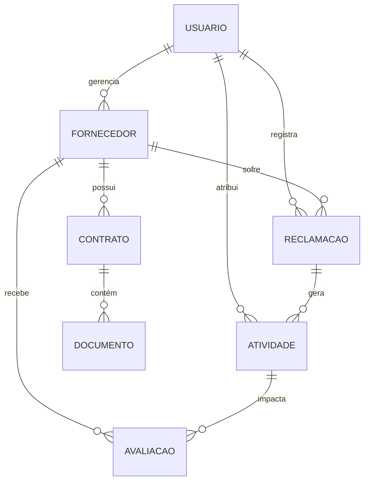

# Gestão de Fornecedores

## Descrição do Projeto
Este projeto tem como objetivo desenvolver uma plataforma de gestão de fornecedores, permitindo um melhor controle e acompanhamento de contratos, avaliações de desempenho e integração de dados para otimização do relacionamento com fornecedores.

## Funcionalidades
- Cadastro e gerenciamento de fornecedores ✅
- Avaliação de desempenho e conformidade ⏳
- Controle de contratos e documentos ⏳
- Notificações e alertas ⏳
- Relatórios e dashboards ⏳


## Relacionamentos




## Roadmap do Projeto
### 1. Planejamento e Estruturação
- [ ] Definir arquitetura do sistema (Monolítico, Microserviços, etc.)
- [ ] Escolher tecnologias de autenticação e autorização
- [ ] Criar estrutura do banco de dados e modelos iniciais

### 2. Desenvolvimento do Back-end
- [x] Configurar projeto Spring Boot e dependências essenciais
- [ ] Implementar autenticação e autorização
- [ ] Criar API para cadastro, edição e exclusão de fornecedores
- [ ] Implementar avaliação de fornecedores com métricas personalizáveis
- [ ] Criar endpoints para gerenciamento de contratos e documentos
- [ ] Desenvolver sistema de notificações e alertas
- [ ] Criar geração de relatórios e dashboards

### 3. Desenvolvimento do Front-end
- [ ] Configurar projeto React.js com TypeScript
- [ ] Criar layout inicial e componentes principais
- [ ] Implementar fluxo de autenticação e gerenciamento de sessão
- [ ] Criar tela de cadastro e gerenciamento de fornecedores
- [ ] Desenvolver interface para avaliação de fornecedores
- [ ] Criar telas para gerenciamento de contratos e documentos
- [ ] Implementar sistema de notificações visuais e alertas
- [ ] Construir painéis interativos para visualização de relatórios

### 4. Infraestrutura e Implantação
- [ ] Configurar Docker para ambiente de desenvolvimento e produção
- [ ] Criar pipeline de CI/CD para deploy automatizado
- [ ] Configurar banco de dados PostgreSQL em ambiente de produção
- [ ] Implantar aplicação em um serviço de nuvem (AWS, Azure ou GCP)
- [ ] Realizar testes de carga e otimização de performance

### 5. Testes e Refinamento
- [ ] Criar testes unitários e de integração no back-end
- [ ] Implementar testes de interface e usabilidade no front-end
- [ ] Refinar a experiência do usuário com base no feedback
- [ ] Corrigir bugs e otimizar código para melhor performance

### 6. Lançamento e Manutenção
- [ ] Criar documentação completa do sistema
- [ ] Publicar primeira versão do projeto
- [ ] Monitorar aplicação e corrigir eventuais problemas
- [ ] Adicionar novas funcionalidades conforme necessidade

## Tecnologias Utilizadas
- **Back-end:** Java (Spring Boot)
- **Front-end:** React.js
- **Banco de Dados:** H2 - local
- **Autenticação:** A definir
- **Infraestrutura:** Docker

## Como Executar o Projeto
1. Clone este repositório:
   ```sh
   git clone https://github.com/Joejohw/Repo_Showcase/Gestão_de_Fornecedores_JAVA
   ```
2. Acesse a pasta do projeto:
   ```sh
   cd Gestão_de_Fornecedores_JAVA
   ```
3. Instale as dependências:
   ```sh
   mvn clean install  # Caso utilize Maven
   ```
4. Configure as variáveis de ambiente no arquivo `.env`.
5. Execute o servidor:
   ```sh
   mvn spring-boot:run
   ```
6. Acesse no navegador: `http://localhost:8080` (ou a porta configurada).

## Contribuição
Contribuições são bem-vindas! Para contribuir:
1. Faça um fork do projeto.
2. Crie uma nova branch: `git checkout -b minha-feature`.
3. Faça as alterações e commit: `git commit -m 'Adiciona nova feature'`.
4. Envie para o repositório: `git push origin minha-feature`.
5. Abra um Pull Request.

## Dores da Gestão de Fornecedores no Brasil
1. **Falta de Padronização**: Empresas enfrentam dificuldades para estruturar e padronizar processos na gestão de fornecedores, resultando em inconsistências e ineficiências.
2. **Baixa Transparência**: Muitas empresas lidam com falta de visibilidade sobre a performance e histórico dos fornecedores, dificultando a tomada de decisões estratégicas.
3. **Gerenciamento de Contratos Ineficiente**: O acompanhamento de contratos e prazos frequentemente é feito manualmente, gerando riscos de não conformidade e custos inesperados.
4. **Dificuldade na Avaliação de Desempenho**: Falta de métricas bem definidas para avaliar fornecedores pode resultar na escolha de parceiros inadequados para os negócios.
5. **Gestão Fragmentada de Dados**: Informações sobre fornecedores frequentemente ficam dispersas entre diferentes departamentos e sistemas, dificultando a análise e tomada de decisão baseada em dados.
6. **Compliance e Regulamentação**: Manter-se atualizado com exigências legais e regulatórias pode ser um desafio, especialmente para empresas que operam em setores altamente regulamentados.
7. **Dependência de Fornecedores Críticos**: Empresas que dependem de poucos fornecedores estratégicos correm o risco de paralisação em caso de falhas na cadeia de suprimentos.

## Licença
Este projeto está licenciado sob a licença MIT. Veja o arquivo `LICENSE` para mais detalhes.

---

**Mantenedor:** Jonathan Silva

**Projeto Solo para Portfólio**
